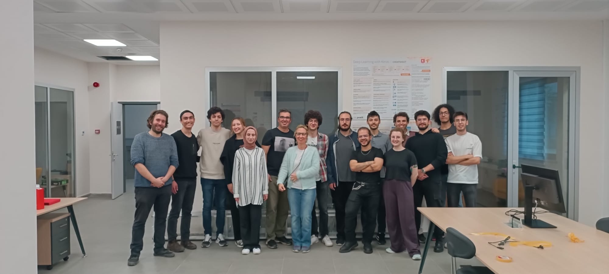

 Welcome to the Applied Artificial Intelligence Research Laboratory at Yildiz Technical University. Our lab is a space where curiosity drives modest yet meaningful advancements in the field of artificial intelligence. We are committed to exploring the potential of AI in a collaborative and thoughtful manner, focusing on sustainable and ethical research. Join our group of dedicated scholars and students as we quietly, yet persistently, seek to understand and harness the power of AI to contribute positively to society and the wider world.

---

 Yıldız Teknik Üniversitesi Uygulamalı Yapay Zeka Araştırma Laboratuvarı'na hoş geldiniz. Laboratuvarımız, merakın yapay zeka alanında mütevazı ancak anlamlı ilerlemelere yön verdiği bir yerdir. Sürdürülebilir ve etik araştırmalara odaklanarak, işbirlikçi ve düşünceli bir şekilde yapay zekanın potansiyelini keşfetmeye kararlıyız. Yapay zekanın gücünü anlamak, topluma ve dünyaya olumlu katkıda bulunmak için sessizce ama ısrarla çalışırken, adanmış akademisyen ve öğrenci grubumuza katılın.

 

