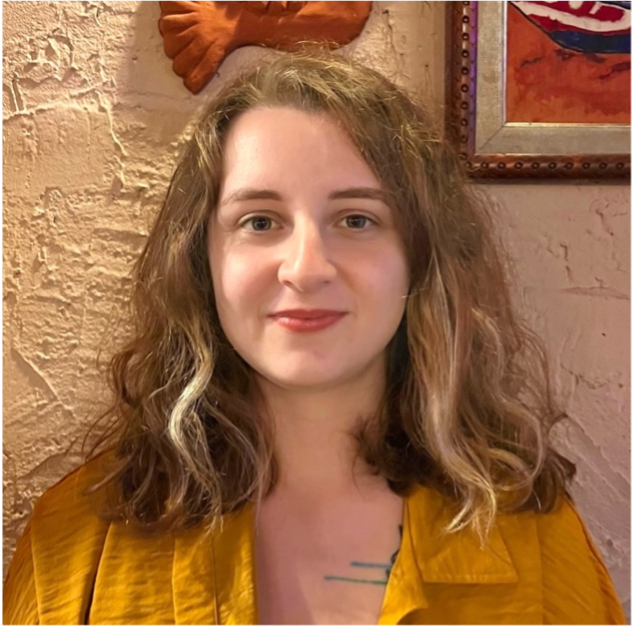

### Prof. Dr. Bora Işıldak

### Assoc. Prof. Nihan Kahraman

### Asst. Prof. Murat Taşkıran

    
    

        
<strong>Asu Güvenli</strong>

        
Graduate Student - MSc

        
B.S. in Physics, Bogazici University

        
MSc in Physics, Ozyegin University, Current

        
e-mail: <a href="mailto:asuguvenli@gmail.com">asuguvenli@gmail.com</a>

        
ayse.asu.guvenli@cern.ch

        
My research focuses on the intersection of Particle Physics and Artificial Intelligence, particularly in using novel AI architectures to solve the B quark jet tagging problem and enhance anomaly detection for CMS HCAL data quality monitoring.

    

