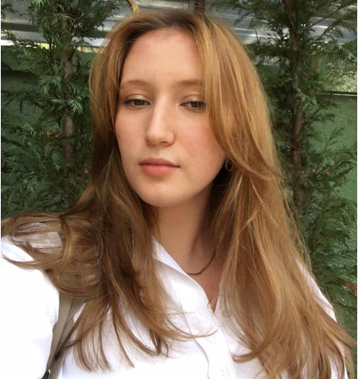

### Prof. Dr. Bora Işıldak

### Assoc. Prof. Nihan Kahraman

### Asst. Prof. Murat Taşkıran

    
    

        
<strong>Asu Güvenli</strong>

        
Graduate Student - MSc

        
B.S. in Physics, Bogazici University

        
MSc in Physics, Ozyegin University, Current

        
e-mail: <a href="mailto:asuguvenli@gmail.com">asuguvenli@gmail.com</a>

        <!-- 
ayse.asu.guvenli@cern.ch
 -->
        
AI Techniques In Particle Physics Research

    

    
    

        
<strong>Eda Erdoğan</strong>

        
MSc Student in Physics

        
Yıldız Technical University, Istanbul

        
e-mail: <a href="mailto:eda.nur.erdogan@cern.ch">eda.nur.erdogan@cern.ch</a>

        
Study field: Experimental High Energy Physics

    

